# 1.Getting Ready

## 1.1 Product Introduction

Tankbot is smart transferring robot with continuous track based on STM32. It is loaded with a robotic arm of 6 DOF, adopts intelligent serial bus servo, and equipped with various modules, including ultrasonic sensor, acceleration sensor, 4-channel line follower, sound sensor, etc. Through APP, handle and somatosensory glove, you can control Tankbot to perform line following, picking, standing after rollover and other funny games.

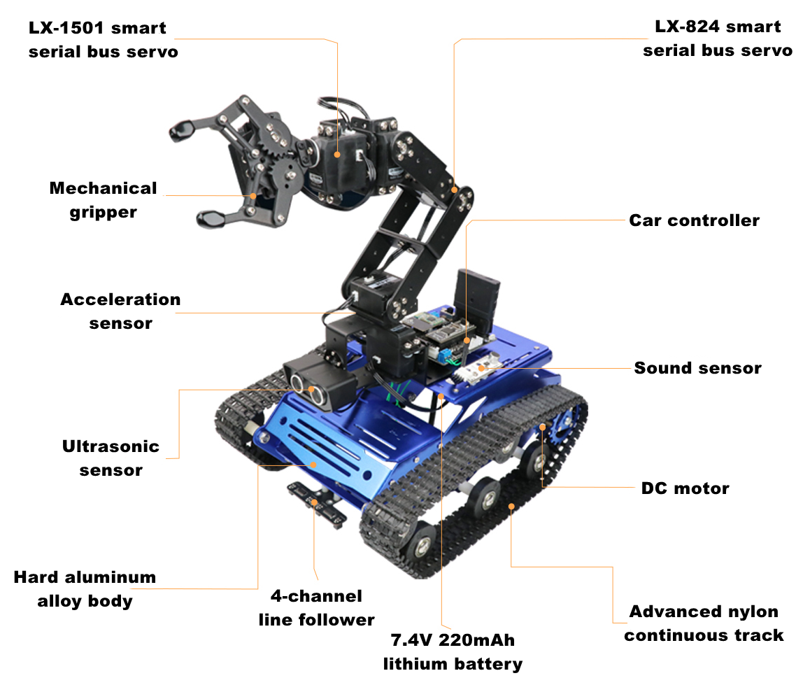

## 1.2 Packing List

**Tankbot Packing List**

<table class="docutils-nobg" style="margin:0 auto" border="1">
<colgroup>
<col style="width: 17%" />
<col style="width: 20%" />
<col style="width: 31%" />
<col style="width: 15%" />
<col style="width: 15%" />
</colgroup>
<tbody>
<tr>
<td colspan="5" style="text-align: center;"><strong>Robot</strong></td>
</tr>
<tr>
<td style="text-align: center;"><strong>NO.</strong></td>
<td style="text-align: center;"><strong>Name</strong></td>
<td style="text-align: center;"><strong>Picture</strong></td>
<td style="text-align: center;"><strong>Quantity</strong></td>
<td style="text-align: center;"><strong>Note</strong></td>
</tr>
<tr>
<td style="text-align: center;">1</td>
<td style="text-align: center;">Tank</td>
<td style="text-align: center;">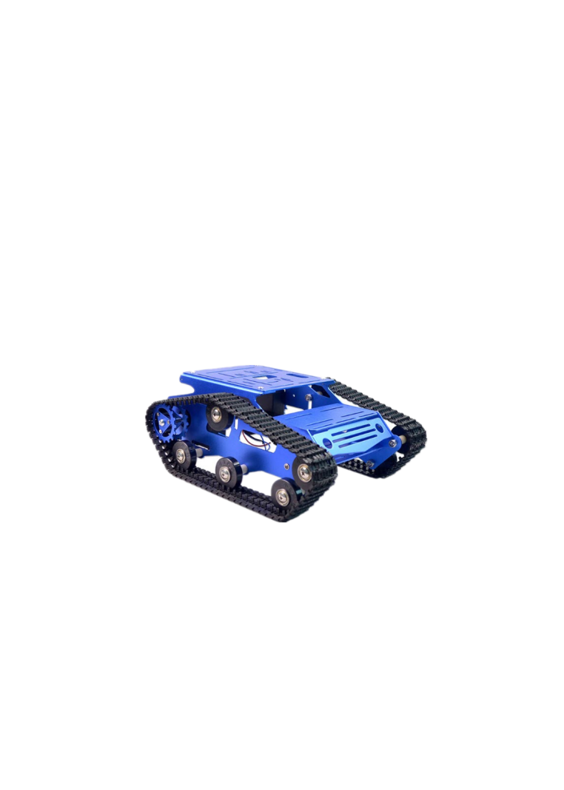</td>
<td style="text-align: center;">1</td>
<td style="text-align: center;"></td>
</tr>
<tr>
<td style="text-align: center;">2</td>
<td style="text-align: center;">Robotic arm of 6 DOF</td>
<td style="text-align: center;">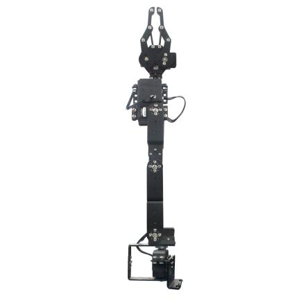</td>
<td style="text-align: center;">1</td>
<td style="text-align: center;"></td>
</tr>
<tr>
<td colspan="5" style="text-align: center;"><strong>Controller</strong></td>
</tr>
<tr>
<td colspan="2" style="text-align: center;"><strong>Name</strong></td>
<td style="text-align: center;"><strong>Picture</strong></td>
<td style="text-align: center;"><strong>Quantity</strong></td>
<td style="text-align: center;"><strong>Note</strong></td>
</tr>
<tr>
<td colspan="2" style="text-align: left;">Open-source controller</td>
<td style="text-align: center;">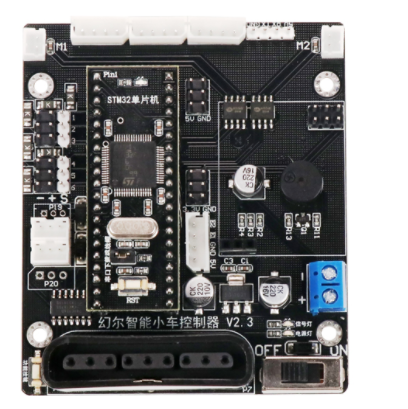</td>
<td style="text-align: center;">1</td>
<td style="text-align: center;"></td>
</tr>
<tr>
<td colspan="5" style="text-align: center;"><strong>Handle + Receiver</strong></td>
</tr>
<tr>
<td style="text-align: center;"><strong>NO</strong></td>
<td style="text-align: center;"><strong>Name</strong></td>
<td style="text-align: center;"><strong>Picture</strong></td>
<td style="text-align: center;"><strong>Quantity</strong></td>
<td style="text-align: center;"><strong>Note</strong></td>
</tr>
<tr>
<td style="text-align: center;">1</td>
<td style="text-align: center;">Handle receiver</td>
<td style="text-align: center;">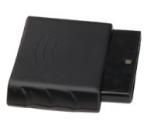</td>
<td style="text-align: center;">1</td>
<td style="text-align: center;"></td>
</tr>
<tr>
<td style="text-align: center;">2</td>
<td style="text-align: center;">PS2 handle</td>
<td style="text-align: center;">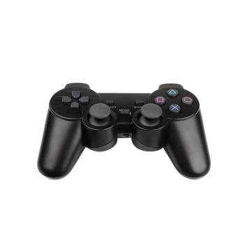</td>
<td style="text-align: center;">1</td>
<td style="text-align: center;"></td>
</tr>
<tr>
<td colspan="5" style="text-align: center;"><strong>Electronic modules expansion pack</strong></td>
</tr>
<tr>
<td style="text-align: center;"><strong>NO</strong></td>
<td style="text-align: center;"><strong>Name</strong></td>
<td style="text-align: center;"><strong>Picture</strong></td>
<td style="text-align: center;"><strong>Quantity</strong></td>
<td style="text-align: center;"><strong>Note</strong></td>
</tr>
<tr>
<td style="text-align: center;">1</td>
<td style="text-align: center;">STM32 microcontroller</td>
<td style="text-align: center;">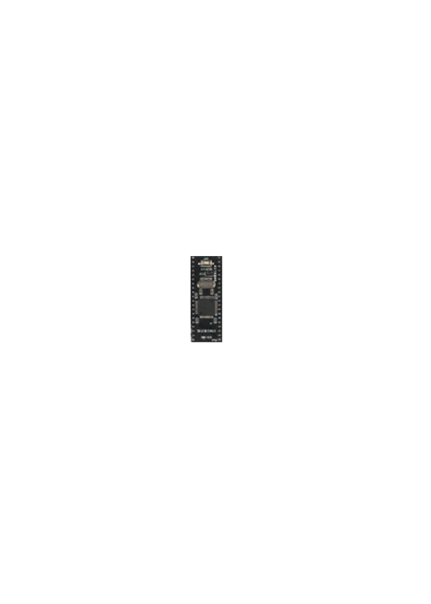</td>
<td style="text-align: center;">1</td>
<td style="text-align: center;"></td>
</tr>
<tr>
<td style="text-align: center;">2</td>
<td style="text-align: center;">USB downloader</td>
<td style="text-align: center;">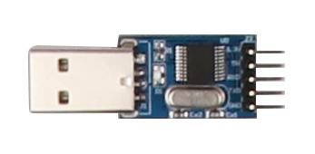</td>
<td style="text-align: center;">1</td>
<td style="text-align: center;"></td>
</tr>
<tr>
<td style="text-align: center;">3</td>
<td style="text-align: center;">Bluetooth module</td>
<td style="text-align: center;">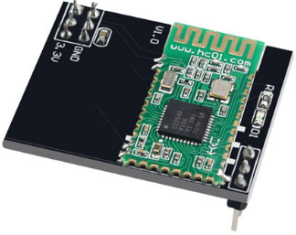</td>
<td style="text-align: center;">1</td>
<td style="text-align: center;"></td>
</tr>
<tr>
<td style="text-align: center;">4</td>
<td style="text-align: center;">Ultrasonic sensor</td>
<td style="text-align: center;">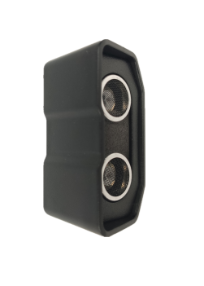</td>
<td style="text-align: center;">1</td>
<td style="text-align: center;"></td>
</tr>
<tr>
<td style="text-align: center;">5</td>
<td style="text-align: center;">4-channel line follower</td>
<td style="text-align: center;">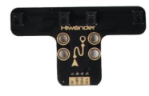</td>
<td style="text-align: center;">1</td>
<td style="text-align: center;"></td>
</tr>
<tr>
<td style="text-align: center;">6</td>
<td style="text-align: center;">Sound sensor</td>
<td style="text-align: center;">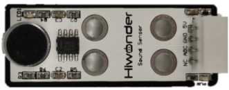</td>
<td style="text-align: center;">1</td>
<td style="text-align: center;"></td>
</tr>
<tr>
<td style="text-align: center;">7</td>
<td style="text-align: center;">Acceleration sensor</td>
<td style="text-align: center;">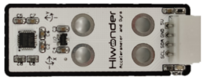</td>
<td style="text-align: center;">1</td>
<td style="text-align: center;"></td>
</tr>
<tr>
<td colspan="5" style="text-align: center;"><strong>Accessory bag1-battery and charger</strong></td>
</tr>
<tr>
<td style="text-align: center;"><strong>NO</strong></td>
<td colspan="2" style="text-align: center;"><strong>Name</strong></td>
<td colspan="2" style="text-align: center;"><strong>Quantity</strong></td>
</tr>
<tr>
<td style="text-align: center;">1</td>
<td colspan="2" style="text-align: center;">Charger 2S</td>
<td colspan="2" style="text-align: center;">1</td>
</tr>
<tr>
<td style="text-align: center;">2</td>
<td colspan="2" style="text-align: center;">lithium battery/ 7.4 V/ dual line 2200mad (converter cable is included)</td>
<td colspan="2" style="text-align: center;">1</td>
</tr>
<tr>
<td colspan="5" style="text-align: center;"><strong>Accessory bag2-wires</strong></td>
</tr>
<tr>
<td style="text-align: center;"><strong>NO</strong></td>
<td colspan="2" style="text-align: center;"><strong>Name</strong></td>
<td colspan="2" style="text-align: center;"><strong>Quantity</strong></td>
</tr>
<tr>
<td style="text-align: center;">1</td>
<td colspan="2" style="text-align: center;">20cm serial port plug-in cable</td>
<td colspan="2" style="text-align: center;">1</td>
</tr>
<tr>
<td style="text-align: center;">2</td>
<td colspan="2" style="text-align: center;">20cm 4PIN sensor wire</td>
<td colspan="2" style="text-align: center;">3</td>
</tr>
<tr>
<td style="text-align: center;">3</td>
<td colspan="2" style="text-align: center;">30cm 4PIN sensor wire</td>
<td colspan="2" style="text-align: center;">3</td>
</tr>
<tr>
<td style="text-align: center;">4</td>
<td colspan="2" style="text-align: center;">20cm Dupont cable</td>
<td colspan="2" style="text-align: center;">6</td>
</tr>
<tr>
<td style="text-align: center;">5</td>
<td colspan="2" style="text-align: center;">Cable tie</td>
<td colspan="2" style="text-align: center;">5</td>
</tr>
<tr>
<td style="text-align: center;">6</td>
<td colspan="2" style="text-align: center;">Phillips screwdriver/ Giveaway/ Small/ Yellow</td>
<td colspan="2" style="text-align: center;">1</td>
</tr>
<tr>
<td style="text-align: center;">7</td>
<td colspan="2" style="text-align: center;">Big screwdriver</td>
<td colspan="2" style="text-align: center;">1</td>
</tr>
<tr>
<td style="text-align: center;">8</td>
<td colspan="2" style="text-align: center;">Spanner</td>
<td colspan="2" style="text-align: center;">1</td>
</tr>
<tr>
<td colspan="5" style="text-align: center;"><strong>Accessory bag3-screws</strong></td>
</tr>
<tr>
<td style="text-align: center;"><strong>NO</strong></td>
<td colspan="2" style="text-align: center;"><strong>Name</strong></td>
<td colspan="2" style="text-align: center;"><strong>Quantity</strong></td>
</tr>
<tr>
<td style="text-align: center;">1</td>
<td colspan="2" style="text-align: center;">M3*5 round mechanical screw</td>
<td colspan="2" style="text-align: center;">30</td>
</tr>
<tr>
<td style="text-align: center;">2</td>
<td colspan="2" style="text-align: center;">M4*6 round mechanical screw</td>
<td colspan="2" style="text-align: center;">4</td>
</tr>
<tr>
<td style="text-align: center;">3</td>
<td colspan="2" style="text-align: center;">M3*8 nylon column</td>
<td colspan="2" style="text-align: center;">10</td>
</tr>
<tr>
<td style="text-align: center;">4</td>
<td colspan="2" style="text-align: center;">M3*15nylon column</td>
<td colspan="2" style="text-align: center;">4</td>
</tr>
</tbody>
</table>

## 1.3 User Manual after Installation

**User Manual**

Having watched previous video, you can follow the below steps to use Tankbot.

Step 1: Start Tankbot

For better using experience, four game programs, including handle control, phone control, line following and standing after rollover, have already been burned into the STM32 microcontroller before delivery. And you can check the tutorials in “2. Quick User Experience”.

Step 2: secondary development prepare

If you have installed STM32 microcontroller referencing the previous assembly , you can move to “3. Set Development Environment” folder to learn Keli installation, program compilation and usage of mcuisp.

Learn and try secondary development games

Please watch the tutorials in order in folder “4. Intelligent Games Lesson”. Each folder in this directory includes program code and video.

In lesson 1, 2 and 3, we will use ultrasonic sensor to cooperate with the tank or the robotic arm. In lesson 4 and 5, 4-channel line follower is used. lesson 6 will involve the usage of acceleration sensor. Lesson 7 will teach you how to use sound sensor. Lesson 8 is about switching between 4 games through key on the controller.

Next, move to the directory “5. Remote control”, and learn how to use handle and phone to control the robot.

Step 4(optional): check the expanded lesson and deepen your understanding of STM32 microcontroller

Having finished the above 3 steps, you can move to the expanded lesson in folder “5. Expanded Lesson” and gain a further understanding of STM32. This directory is also helpful for user who have purchased somatosensory glove and Wi-Fi camera.
