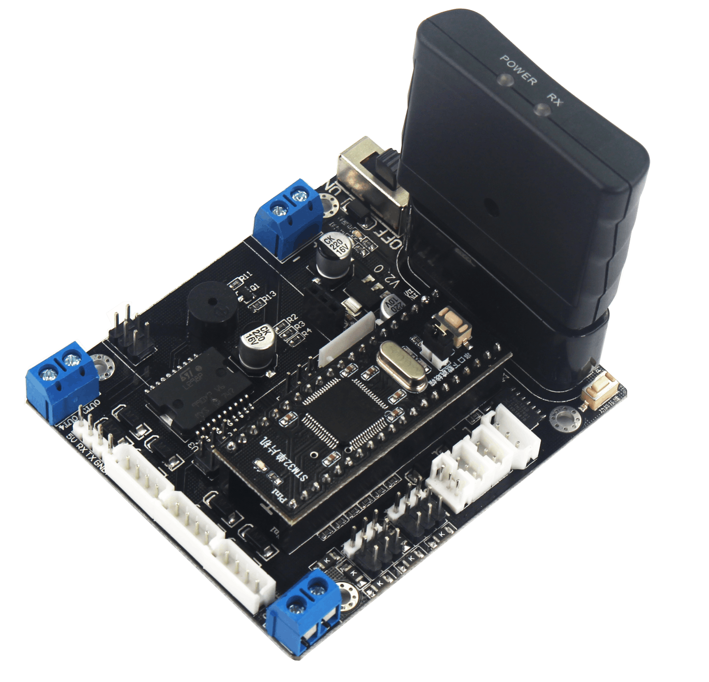
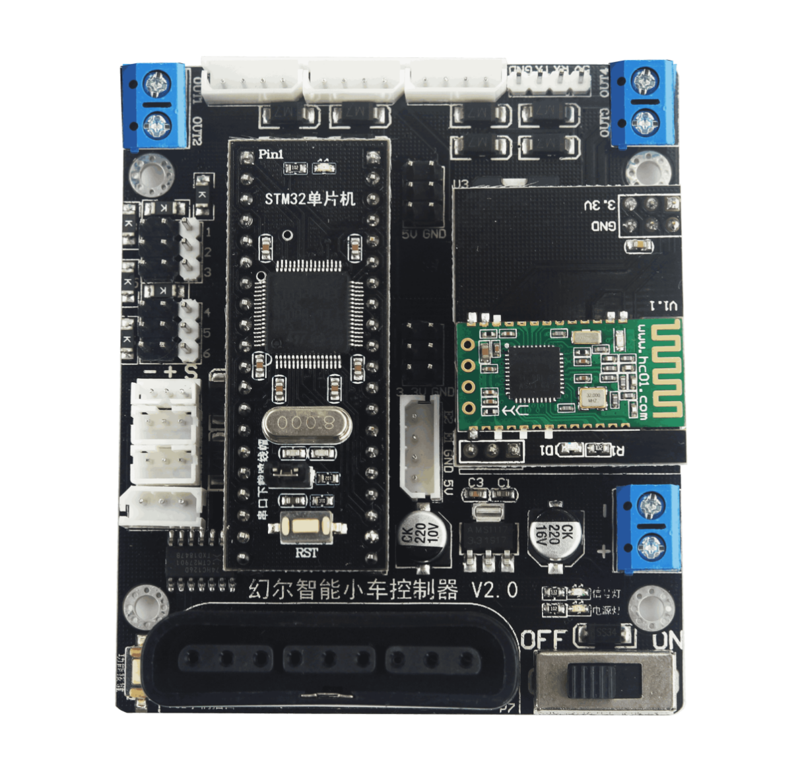
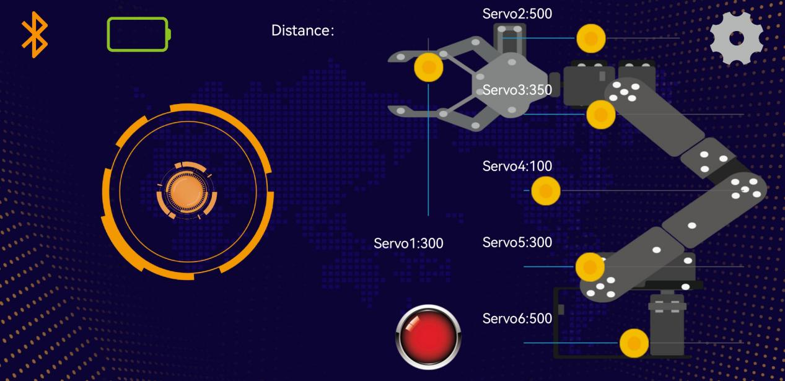
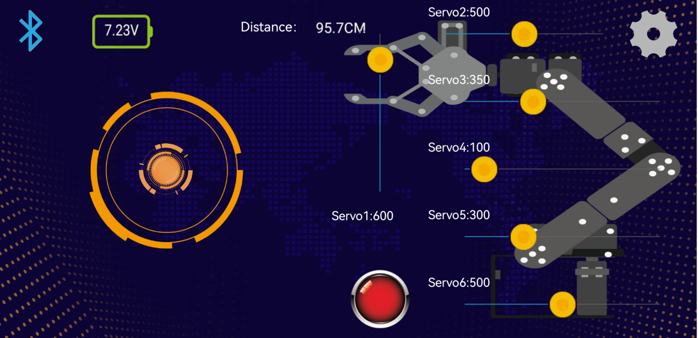
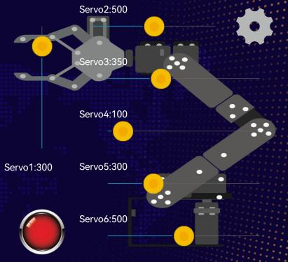
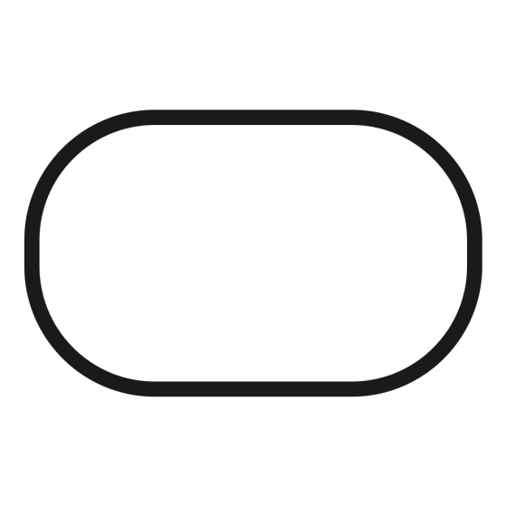
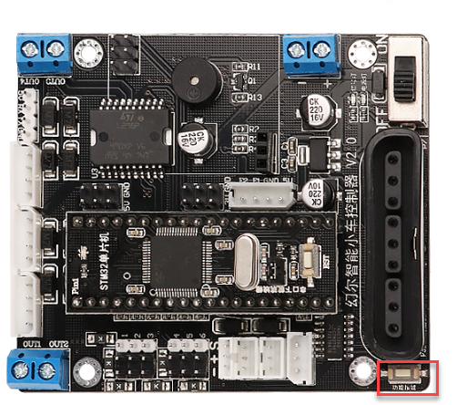

# 2.Quick User Experience

## 2.1 Preface

For better using experience, the game switching program has already been burned into the microcontroller before delivery. This program involves four games, including handle control, phone control, line following and standing after rollover. By pressing the function key on the controller, you can switch the games at will.

The Tankbot will be in handle and phone control modes by default after booting up. There is no need to press the function key.

1)  The blue signal will flash once when you first press the function key, which means that the Tankbot is switched to line following game.

2)  When you press the function key again, the blue signal will also flash once, which indicates that the Tankbot is switched to standing after rollover game.

3)  Continue to press the function key, and the blue signal will flash once meaning that the Tankbot is switched to phone and handle control mode.

## 2.2 Handle Control

Demo video is in this folder for your reference.

### 2.2.1 Preparation

Step 1: install the handle receiver on the controller.

Step 2: Insert two AAA batteries into the battery slot. Please don’t invert the negative and positive pole.

### 2.2.2 Device connection

Step 1: switch on the Tankbot

Step 2: turn on the handle. Then the green and blue LED light will flash simultaneously

Step 3: A few seconds later, the Tankbot will match with the handle automatically, after which two LED lights will be on.

Step 4: if the connection fails, please turn off the Tankbot and the handle. And operate again.

Sleep mode: if the Tankbot doesn’t connect to the handle within 30s, or there is no operation after connection, the handle will enter sleep mode

### 2.2.3 Key function

|    **Key**    |                       **Function**                        |
| :-----------: | :-------------------------------------------------------: |
|     START     |              Reset/ Wake up the robotic arm               |
| Left joystick | Control the tank to move forward, backward, right or left |
|       ↑       |             lower down the whole robotic arm              |
|       ↓       |                lift the whole robotic arm                 |
|       ←       |              make the robotic arm turn left               |
|       →       |              make the robotic arm turn right              |
|     **△**     |       lower down the upper part of the robotic arm        |
|     **×**     |          lift the upper part of the robotic arm           |
|     **◻**     |                  lower down the gripper                   |
|       ○       |                     lift the gripper                      |
|    **L1**     |                make the gripper turn left                 |
|    **R1**     |                make the gripper turn right                |
|    **L2**     |                     close the gripper                     |
|    **R2**     |                     open the gripper                      |

## 2.3 Phone Control

You can watch demo video in this folder. Phone control can only be operated on Android device and the device version should be above 5.0.

### 2.3.1 Mobile APP Installation

“Tankbot-V1.5.apk” installation package can be found in “APP Installation Package” folder. Please install it on your phone.

### 2.3.2 Device connection

> [!NOTE]
>
> 1)  Before using the APP, please turn on the Bluetooth and Location.
>
> 2)  Please directly pair the device Bluetooth by tapping the Bluetooth icon on the APP, and don’t operate through key in phone settings.
>

Step 1: please check whether the Bluetooth module is installed or not. Then switch on the Tankbot.

Step 2: open the APP.

Step 3: tap the Bluetooth icon in the upper left corner, then the around device is being searched. Please wait for a while, then select “Hiwonder”.

Step 4: the Bluetooth icon will turn blue after connection. And the battery level of Tankbot will be displayed on the upper left corner.

### 2.3.3 Key Function

|                                                              |                                                              |
| :----------------------------------------------------------: | :----------------------------------------------------------: |
|                             Icon                             |                           Function                           |
|  | Drag the icon to control Tankbot move forward, backward and rotate |
|  | Control the specific part of the robotic arm to rotate. The control area corresponds to ID 1-6 servos. |
|  | After tapping it, the robotic arm will stop the current action and all the servos will return to the initial posture. |
|  |    You can set the moving speed and check the APP version    |
|  | Click this icon to search the device. This icon will turn blue if the connection is successful. |
|  |                        Battery level                         |
|  | Distance measured by ultrasonic sensor. The figure in the picture is only an example. |

## 2.4 Line Following

Demo video is in this folder for your reference.

### 2.4.1 Preparation

Step 1: in this lesson, we will use 4-channel line follower. For installation detail, you can refer to the videos “4. Install Three Sensors on the Tank” and “5.Sensor Wiring” saved in “1.Getting Ready-\>2.Installation Tutorial-\>”

Step 2: you need to prepare black line, and the black line should not be too thick.

### 2.4.2 Operation Step

If the line following performance doesn’t meet your requirement, you can refer to the video “2. Line Follower Sensitivity Adjustment” in “7. Appendix-\>4. Debugging Tutorial”.

Step 1: switch on the Tankbot.

Step 2: put the Tankbot on the laid black line, then press the function key on the controller. When the blue signal flashes once, it means that the game starts successfully.

Step 3: at this time, the wheels of Tankbot will start rotating, and then Tankbot will move along the black line.

## 2.5 Standing after rollover

You can watch the demo video in this folder. Only when the line following game starts, you can switch to this game by pressing the function key.

### 2.5.1 Preparation

Acceleration sensor is needed. And you need to place Tankbot on hard ground.

### 2.5.2 Operation steps

1)  Switch on Tankbot

2)  Place Tankbot on the flat ground, and then press the function key on the controller. When the blue signal flashes once, it means that the line following game starts successfully.

3)  Press the function key again. Then the blue signal will flash once, which means the game is switched to standing after rollover.

4)  Place the Tankbot **side** on flat ground. After a while, Tankbot will “stand”.

If you want to switch to other games, you can press the function key again, and the game will be switched to handle and phone control mode.
