# 3.Set Development Environment

> [!NOTE]
>
> To avoid compilation failure and influence on normal use, please activate Keil software after installation.

For activation method, you can refer to the file “Keil Activation Tutorial” ”saved in “Keil Installation Package and mcuisp Dowdloader”. If you use Keil for commercial purpose, please purchase legitimate version.

## 3.1 Keil software installation

Keil C51 is a powerful software customized for microcontroller.

1)  Please double click to open “mdk500.exe” file in “Keil Installation Package and mcuisp Dowdloader” folder.

2)  Tick “I agree”.

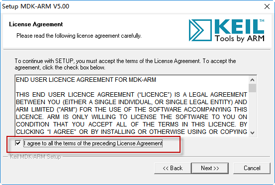

3)  Select the folder where Keil will be installed.

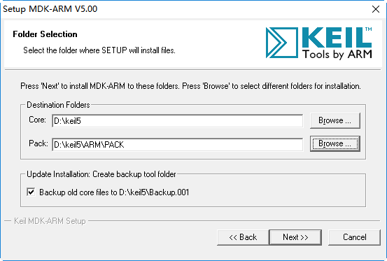

4)  You will be required to enter the user information, and you can fill in at will.

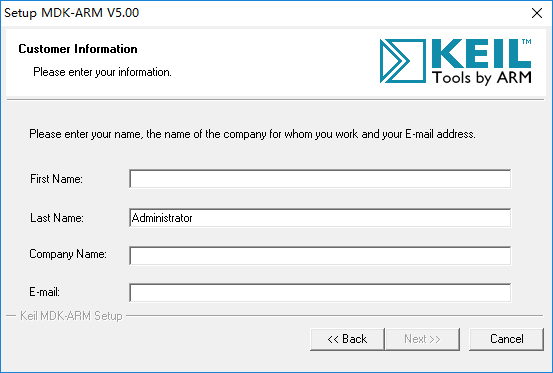

5)  After entering, click “Next” to install.

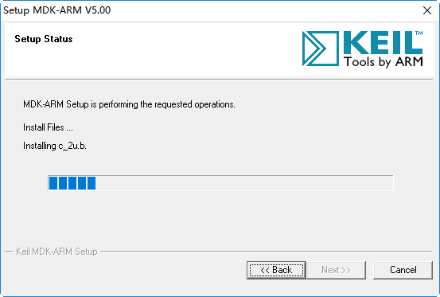

6)  Please wait for a while, a window will pop up asking you to install this software, and just click “Install”

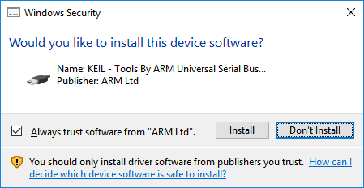

7)  Click “Finish” after installation.

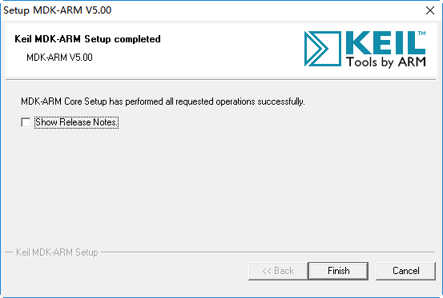

## 3.2 Keil program compilation

To facilitate user to quickly experience the games, all the programs have been compiled with the corresponding .hex file, therefore just have a look.

1)  Double click to open this project in this path “Sample Program-\>LED Flashing Program-\>STM32_LED”.

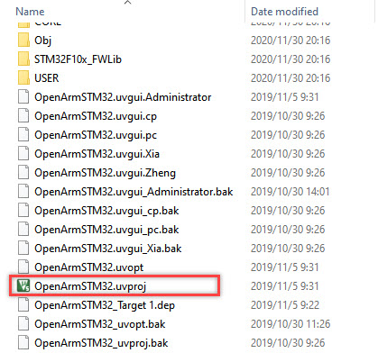

2)  After opening the project, you need to configure and set the file option. Click , and then follow the below picture for the settings.

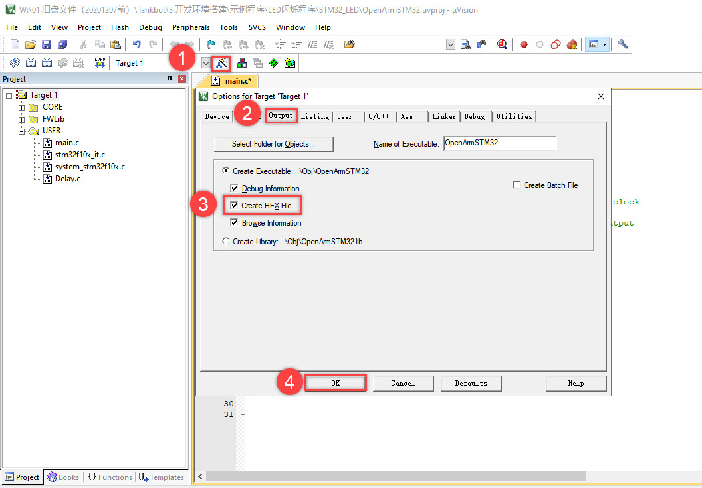

3)  Next, compile the target file in this project, and click the three icons in red frame in sequence. After a while, the compilation result will be displayed in the bottom area. And the below picture shows that the compilation is successful.

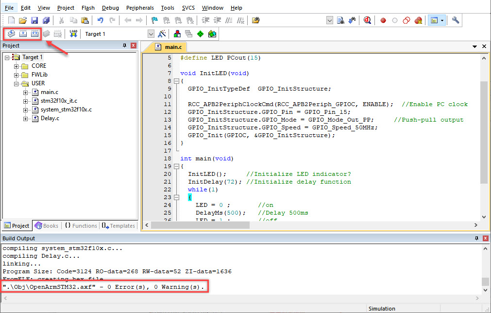

4)  As long as there is no error in compilation, .hex file will be automatically generated, which is saved in Obj folder.

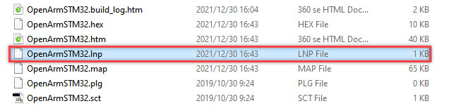

## 3.3 Methods to download program

Before downloading the program, please ensure the serial port driver is installed. The “ch341ser.exe” driver file can be found in “Keil Installation Package and mcuisp Downloader”

You can watch “Download Program” demo video in “Sample Program” folder.

1)  Connect USB downloader to controller through Dupont Line. Ensure GND to GND, RXD to TX, and TXD to Rx when connecting.

2)  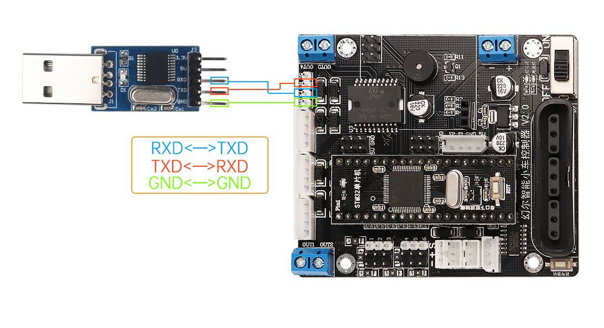Remove the Jumper cap, framed in red, on STM32 to make STM32 enter burning mode.

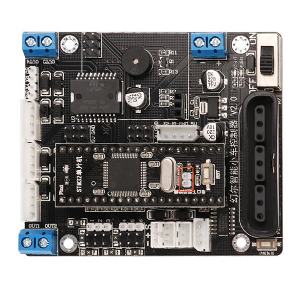

3)  Insert the downloader to any interface of the computer, and then switch on the controller. And you need to know the corresponding interface. Right click “Computer” and select “Attribute and Device Manager” in turns.

If you remove the Jumper cap after switching on the controller, you need to press RST key to enter burning mode.

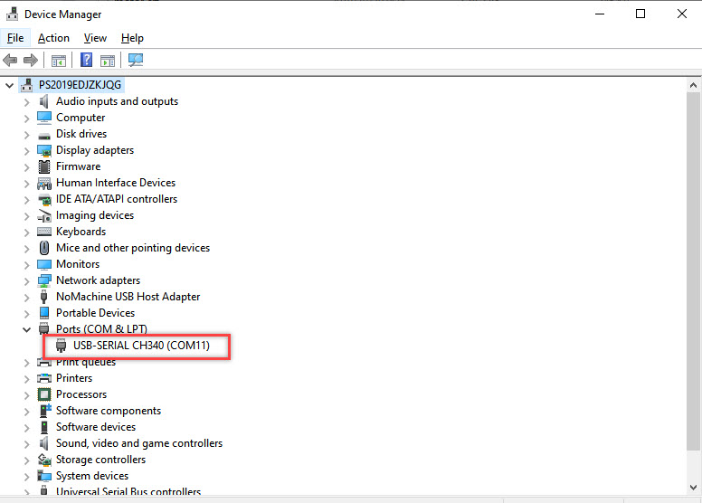

4)  Mcuisp downloader will also be used. Please open  saved in “Keil Installation Package and mcuisp Downloader” folder.

5)  Select the corresponding serial port and baud rate. Here take COM11 for example. The interfaces may vary from each computer and please select the corresponding interface. COM1 generally is system communication port not actual port of the controller. The baud rate is 115200, and please don’t modify it.

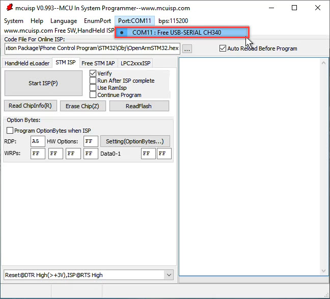

6)  Click  in the interface and select the folder where .hex file will be stored.

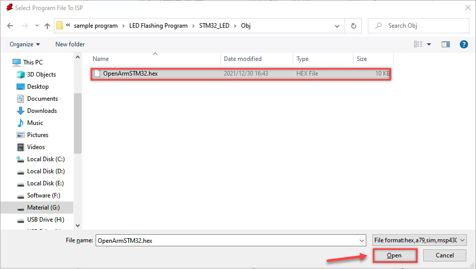

7)  Next, set the “**STMISP**”, and uncheck “ Execute after Programming” and other options remain the same.

“Execute after Programming”: the program will be ran as soon as the program is burned into the microcontroller successfully. Hence it is not recommended to check this option. If you have checked this option, you need to keep away from the robotic arm’s moving area to avoid injury.

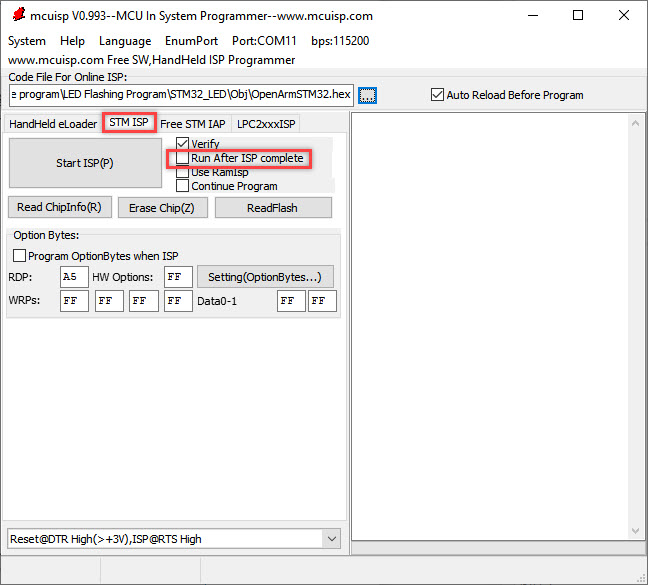

8)  After setting, click “Start Programming” button, then the program can be burned into the controller. When the message “Anything OK” appears, it means that the program is burned completely.

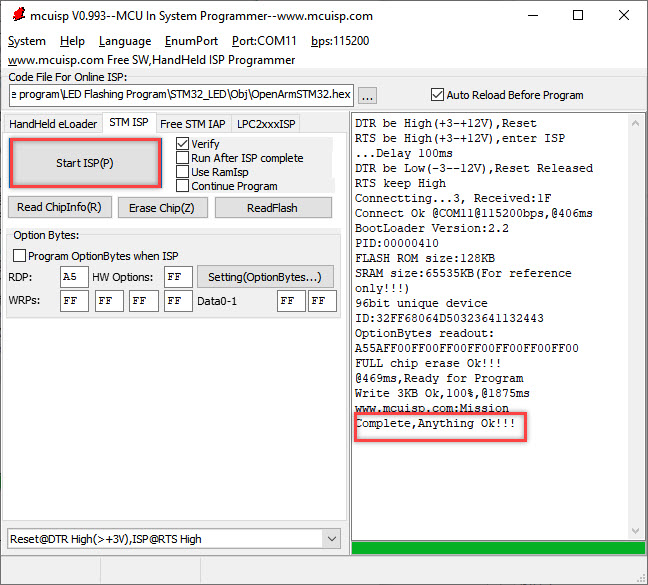

If it prompts "chip times out and does not response", it means that it has not switched to burning mode. First check whether the jumper cap is unplugged, and then press the RST button.

9)  Next, we can disconnect the USB downloader, and then reinsert the jumper cap into the STM32. Press the RST button to switch to the running mode. At this time, we can observe that the blue signal on the controller will continue to flash.

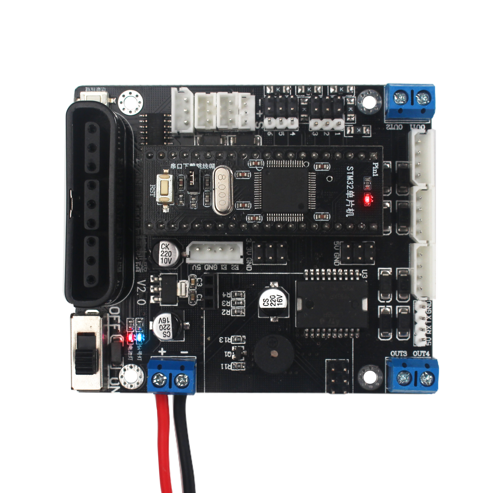

You can refer to this lesson to download the program in “4. Intelligent Games Lesson” and “5. Remote Control”.
