# 4.Intelligent Games Lesson

## 4.1 Lesson 1 Ultrasonic Following

The demo video is in this folder for your reference.

### 4.1.1 Preparation

1.  Ultrasonic sensor connection.

2.  Prepare a box or a notebook.

### 4.1.2 Program logic

Use ultrasonic sensor to detect the distance of the obstacle ahead. And set condition to make the Tankbot move forward or backward.

Sound wave with a frequency 20~20000Hz can be heard by human, while frequency with over 20000Hz is not audible. Ultrasonic gets its name because its lower frequency limit is approximately equal to the upper limit of human hearing. Hence we call the sound wave with a frequency over 20000Hz “Ultrasonic”. Ultrasonic sensor can convert ultrasonic signal into other energy signal.

There are two probes on ultrasonic sensor, which are used to transmit and receive the ultrasonic. It will send 8 40khz square waves automatically when ranging to detect whether there is returned signal. If there is, it will output high level. The duration of high level is the time spent on transmission and returning by ultrasonic.

Formula: distance=(high level duration\* sound speed(340M/S))/2

### 4.1.3 Operation step

1)  Remove the jumper cap on STM32.

2)  Connect the controller to computer through USB downloader.

3)  Double click to open mcuisp to download

4)  Select the corresponding port and baud rate. Then open the folder where the compiled hex file is saved, and click “Start Programming”.

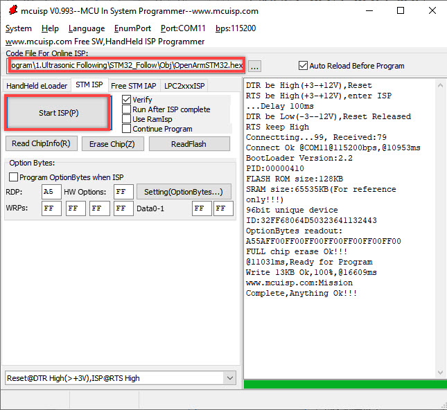

5)  Please wait till the program is burned. After that, reinsert the jumper cap into the STM32, and then press RST button.

### 4.1.4 Function Realization

Place the Tankbot on the flat ground. Place a box or book in front of the ultrasonic sensor, then it will range the distance between them. When move the book towards ultrasonic sensor, Tankbot will move backwards. When move the book backward, it will move forward.

## 4.2 Lesson 2 Ultrasonic Obstacle Avoidance

The demo video is in this folder for your reference.

### 4.2.1 Preparation

1.  Ultrasonic sensor connection.

2.  Prepare a few boxes

### 4.2.2 Program logic

Use the ultrasonic sensor to detect the distance of the obstacle ahead, and make Tankbot avoid the obstacle automatically through programming.

Sound wave with a frequency 20~20000Hz can be heard by human, while frequency with over 20000Hz is not audible. Ultrasonic gets its name because its lower frequency limit is approximately equal to the upper limit of human hearing. Hence we call the sound wave with a frequency over 20000Hz “Ultrasonic”. Ultrasonic sensor can convert ultrasonic signal into other energy signal, electrical signals generally.

There are two probes on ultrasonic sensor, which are used to transmit and receive the ultrasonic. It will send 8 40khz square waves automatically when ranging to detect whether there is returned signal. If there is, it will output high level. The duration of high level is the time spent on transmission and returning by ultrasonic.

Formula: distance=(high level duration\* sound speed(340M/S))/2

### 4.2.3 Operation steps

1)  Remove the jumper cap on STM32

2)  Connect the controller to computer through USB, and then switch on the controller.

3)  Double click to open mcuisp downloader.

4)  Select the corresponding port and baud rate. Then open the folder where the compiled hex file is saved, and click “Start Programming”.

5)  Please wait till the program is burned. After that, reinsert the jumper cap into the STM32, and then press RST button.

### 4.2.4 Function realization

Build obstacle avoidance environment with some boxes. When Tankbot is moving forward, it will detect whether there is box ahead through ultrasonic sensor. If there is, it will make a turn and continue its moving.

## 4.3 Lesson 3 Fixed Distance Picking

The demo video is in this folder for your reference.

### 4.3.1 Preparation

1.  Ultrasonic sensor connection.

2.  Robotic arm installed on the tank.

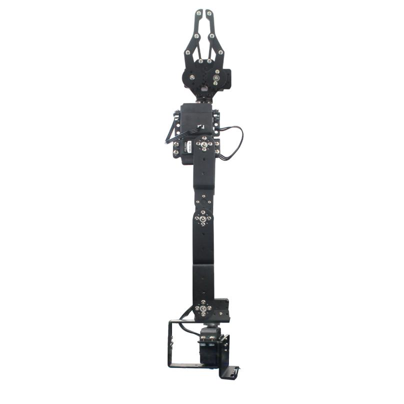

3.  Prepare an object to pick. Its weight should not be over 200g, its height should be greater than 20cm and its width is around 3cm.

### 4.3.2 Program logic

Picking function is realized by the combination of ultrasonic sensor and servos. Firstly, range the distance between the object and Tankbot through the ultrasonic sensor. When the distance meets the set value, the servos on the robotic arm will execute the picking action.

### 4.3.3 Operation steps

1)  Remove the jumper cap on STM32.

2)  Connect the controller to computer through USB.

3)  Double click to open mcuisp

4)  Select the corresponding port and baud rate. Then open the folder where the compiled hex file is saved, and click “Start Programming”.

5)  Please wait till the program is burned. After that, reinsert the jumper cap into the STM32, and then press RST button.

### 4.3.4 Function Realization

Place the object in front of the ultrasonic sensor. After the ultrasonic sensor detects the object, the robotic arm will pick the object and place it aside.

## 4.4 Lesson 4 Line Following

The demo video is in this folder for your reference.

### 4.4.1 Preparation

1.  4-channel line follower connection

2.  Prepare black line and it should not be too thick.

### 4.4.2 Program logic

This game is by 4-channel line follower. And there are four probes on it. Each probe involves a pair of infrared receiver and infrared receiver.

Because the light can be reflected, the reflected light will be formed when the light emitted by infrared encounters an object. If the infrared light is reflected, when it encounters a white or other light-colored surface, the receiver will receive an infrared signal. At this time, the blue LED indicator in the back of the line follower will be on. If the infrared light is absorbed or cannot be reflected, the receiver cannot receive the infrared signal.

When the receiver probe receives the signal, it will send the signal to the microcontroller. Finally, the internal program in microcontroller will control the Tankbot’s movement.

### 4.4.3 Operation steps

1)  Remove the jumper cap on STM32.

2)  Connect the controller to computer through USB downloader.

3)  Double click to open mcuisp.

4)  Select the corresponding port and baud rate. Then open the folder where the compiled hex file is saved, and click “Start Programming”.

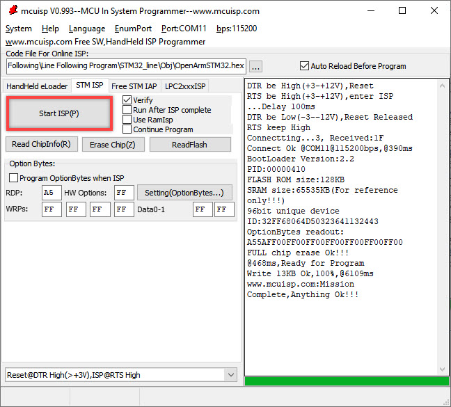

5)  Please wait till the program is burned. After that, reinsert the jumper cap into the STM32, and then press RST button.

### 4.4.4 Function realization

If its line following performance doesn’t meet your requirement, you can adjust its sensitivity. For more details, you can refer to the demo video “Line Follower Sensitivity Adjustment” in “Appendix-\>4.Debugging Tutorial”.

Place Tankbot on the laid black line, and then the Tankbot will move along the black line.

## 4.5 Lesson 5 Line Following and Picking

The demo video is in this folder for your reference.

### 4.5.1 Preparation

1.  Ultrasonic connection

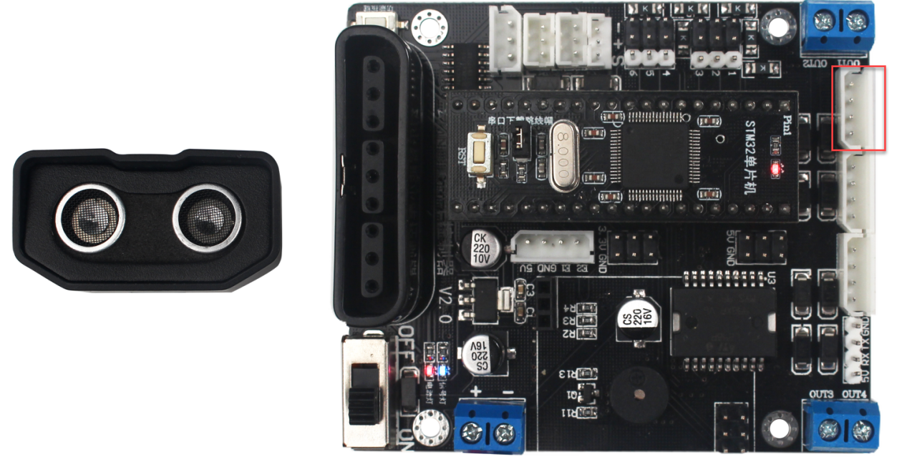

2.  4-channel line follower connection.

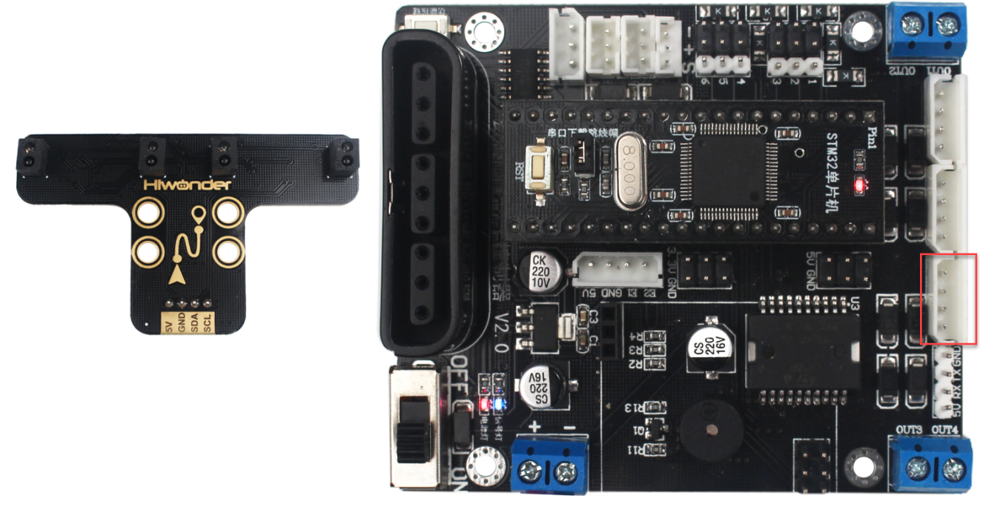

3.  Prepare a black line which should not be too thick.

4.  Prepare an object to pick, whose weight should not exceed 200g, height should be greater than 20cm, and width should be approximately equal to 3cm.

### 4.5.2 Program logic

This game is the combination of games “**Fixed Distance Picking**” and “**Line Following**”. Firstly, use 4-channel line follower to detect the black line to make Tankbot move along the black line. Next, the ultrasonic sensor will be used for obstacle detection. If the obstacle is within the detection range, the robotic arm will pick the obstacle after detection.

### 4.5.3 Operation steps

1)  Remove the jumper cap on STM32.

2)  Connect the controller to the computer through USB, and then switch on the controller.

3)  Double click to open mcuisp.

4)  Select the corresponding port and baud rate. Then, open the compiled hex file and click “Start Programming”.

5)  Wail for the program to burn. After the program is burned, reinsert the jumper cap into STM32, and press RST button.

### 4.5.4 Function realization

If the line following performance cannot meet your requirement, you can adjust the sensitivity of the sensor according to the video in “7.Appendix-\>4.Debugging Tutorial”.

Place an object on the laid black line. Tankbot will move along the black line. Having detected the object ahead through ultrasonic sensor, it will place the object aside and move on.

## 4.6 Lesson 6 Standing after Rollover

The demo video is in this folder for reference.

### 4.6.1 Preparation

1.  acceleration sensor connection.

2.  The robotic arm installed on the tank.

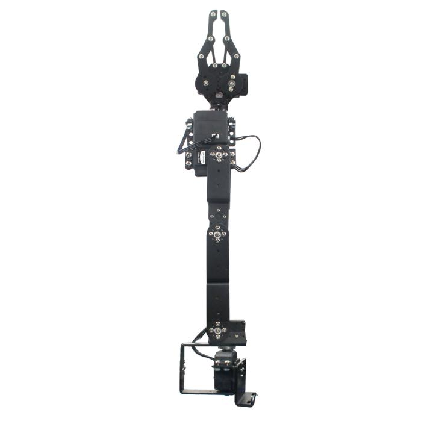

### 4.6.2 Program logic

Detect the current state of the Tankbot through acceleration sensor. Based on the robot state, run the built-in action group to make the robot “stand” after rollover.

Acceleration sensor is composed of accelerometer and gyroscope. Accelerometer can measure linear acceleration, and the gyroscope measures angular velocity

Accelerometer is based on the force balance principle and gyroscope is based on inertia principle. The value measured by accelerometer over a long period of time is accurate, while there will be error in the value measured in a short period of time due to the noise. However, gyroscope takes the opposite. Therefore, the cooperation of these two is needed to achieve the correct navigation.

### 4.6.3 Operation steps

1)  Remove the jumper cap on STM32.

2)  Connect the controller to the computer through USB, and then switch on the controller.

3)  Double click to open mcuisp.

4)  Select the corresponding port and baud rate. Then, open the compiled hex file and click “Start Programming”.

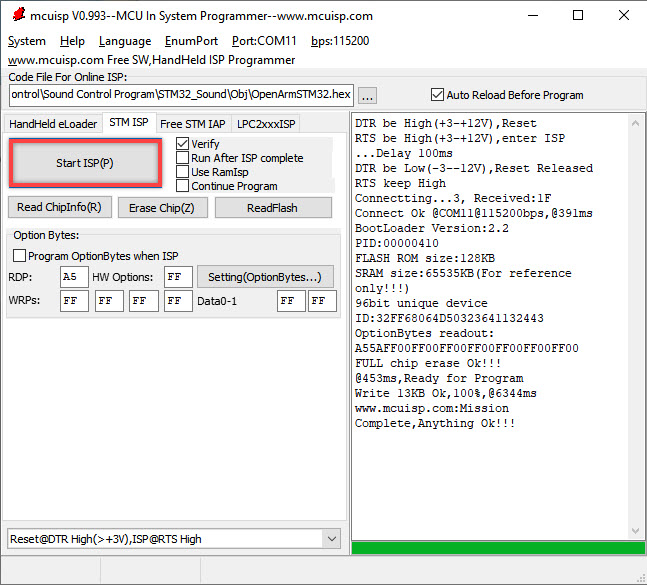

5)  Wail for the program to burn. After the program is burned, reinsert the jumper cap into STM32, and press RST button.

### 4.6.4 Function realization

> [!NOTE]
>
> Please place the Tankbot on hard ground.

Place the Tankbot side on flat ground. After a while, the Tankbot will “stand” after rollover.

## 4.7 Lesson 7 Sound Control

The demo video is in this folder for your reference.

### 4.7.1 Preparation

1.  sound sensor connection

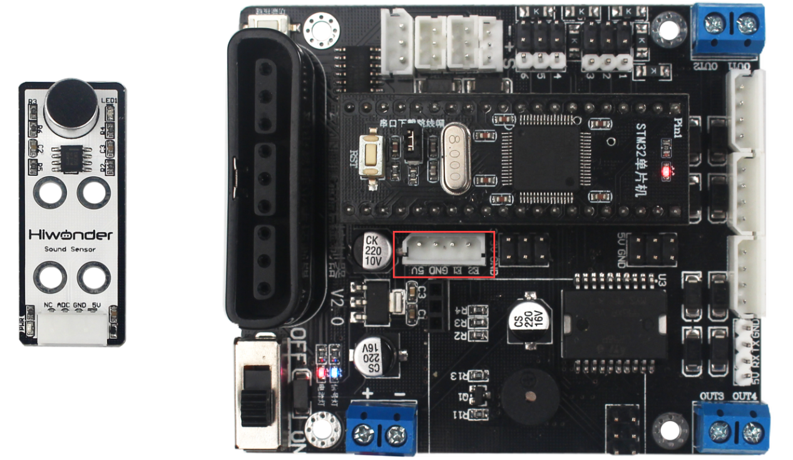

2.  The robotic arm installed on the tank.

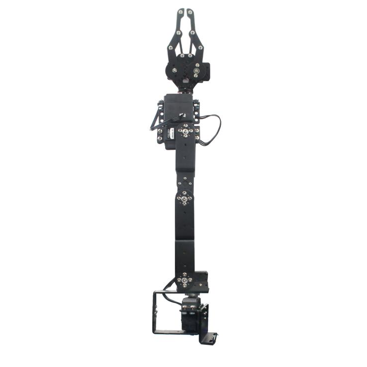

3.  Prepare an object to pick, whose weight should not exceed 200g.

### 4.7.2 Program logic

The sound sensor is equivalent to a switch and detects sound intensity through the ADC output. The detection range is from 0 to 1023. The greater the sound intensity is, the greater the value will be. Therefore, we can control the robotic arm to pick objects by obtaining the sound value.

### 4.7.3 Operation steps

1)  Remove the jumper cap on STM32.

2)  Connect the controller to the computer through USB, and then switch on the controller.

3)  Double click to open mcuisp.

4)  Select the corresponding port and baud rate. Then, open the compiled hex file and click “Start Programming”.

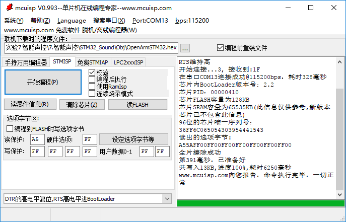

5)  Wail for the program to burn. After the program is burned, reinsert the jumper cap into STM32, and press RST button.

### 4.7.4 Function realization

Please play this game in quiet environment.

Face the Tankbot and place the object to the right side. Then clap to make a sound. When the clap is first detected by the sound sensor, the indicator on it will light up and the robotic arm will pick and place the object to the right side of Tankbot. When the second sound is sensed, the robotic arm will pick and place the object at the right side to the other side. And Tankbot will execute alternately in this direction.

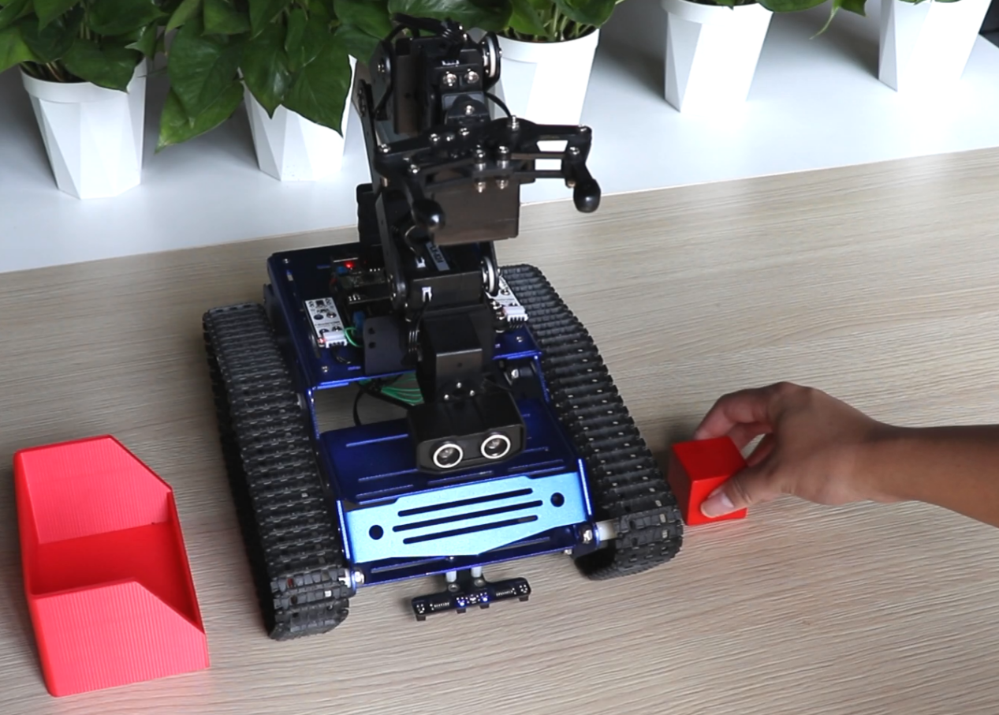

## 4.8 Lesson 8 Games Switching

The demo video is in this folder for your reference.

### 4.8.1 Preparation

1.  handle receiver connection.

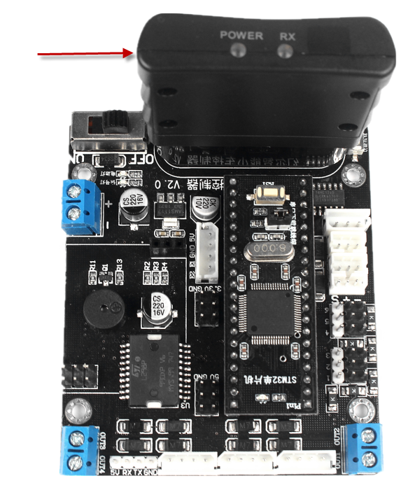

2.  Bluetooth module connection.

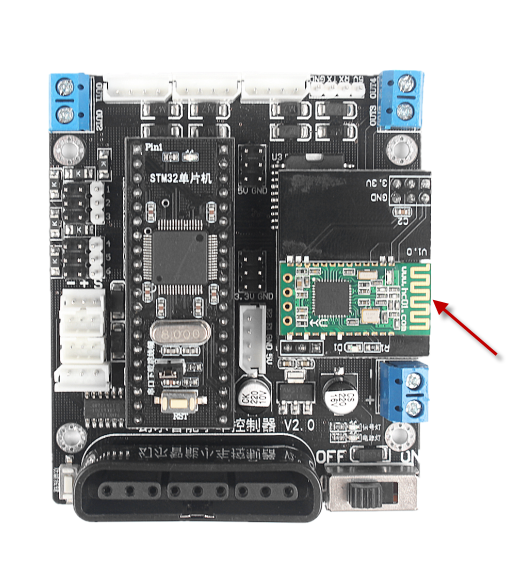

3.  acceleration sensor connection.

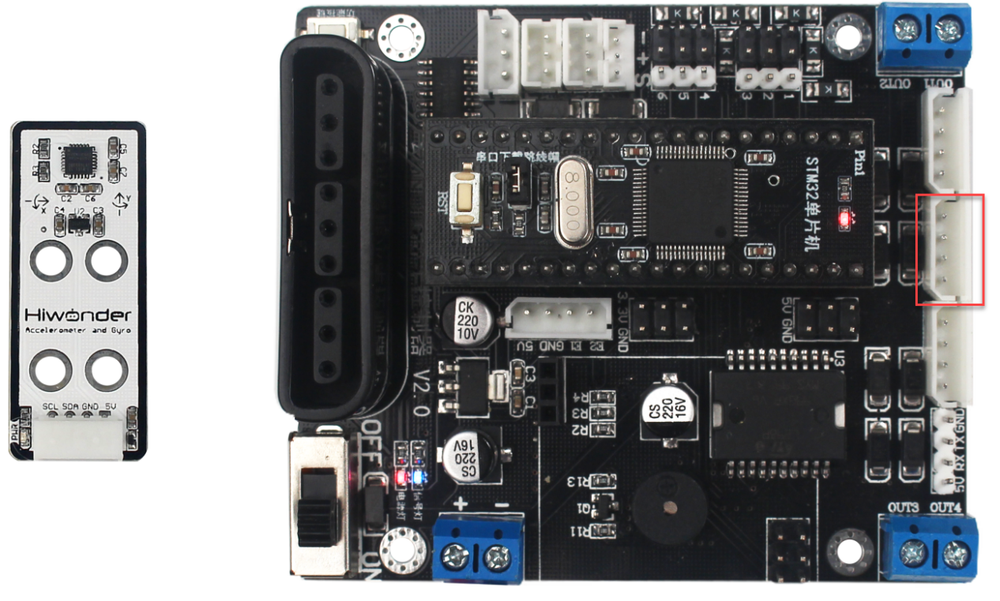

4.  4-channel line follower connection.

5.  Prepare a black line which should not be too thick.

### 4.8.2 Program logic

This game is a combination of four different games. By pressing the function key on the controller, you can switch between four games, including handle control, phone control, line following and standing after rollover.

### 4.8.3 Operation steps

1)  Remove the jumper cap on STM32.

2)  Connect the controller to the computer through USB downloader, and then switch on the controller.

3)  Double click to open mcuisp downloader.

4)  Select the corresponding port and baud rate. Then, open the compiled hex file and click “Start Programming”.

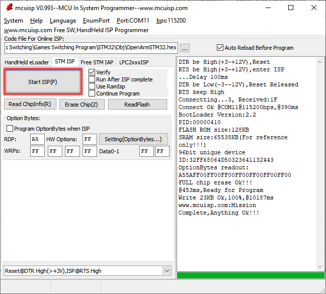

5)  Wail for the program to burn. After the program is burned, reinsert the jumper cap into STM32, and press RST button.

### 4.8.4 Function realization

Please pay attention you cannot control the Tankbot through phone and handle simultaneously. If you fail to switch the game, you can press the function key for several times till the blue signal flashes, which means that the game is switched successfully.

When the program is executed, the Tankbot is in handle and phone control mode by default, and you can directly experience handle or phone control.

1)  Press the function key, and then the blue signal will flash once, which means that the game is switched to line following.

2)  Press the function key again, and then the blue signal will flash once, indicating that the game is switched to standing after rollover.

3)  Press the function key again, and then the blue signal will flash once meaning that the game is switched to phone and handle control.
