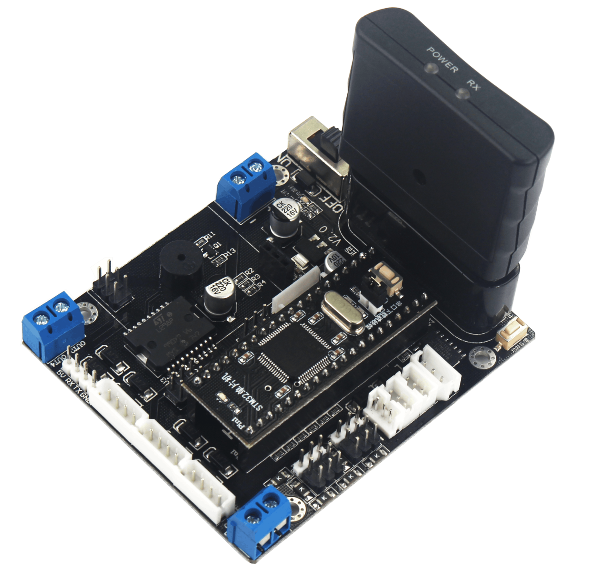
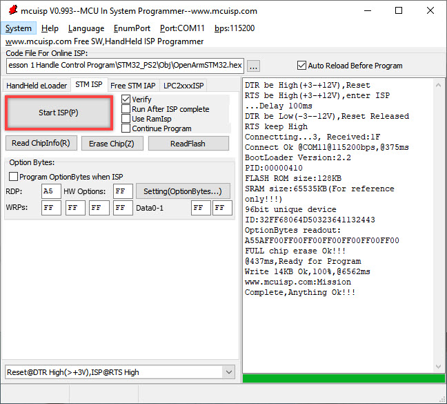
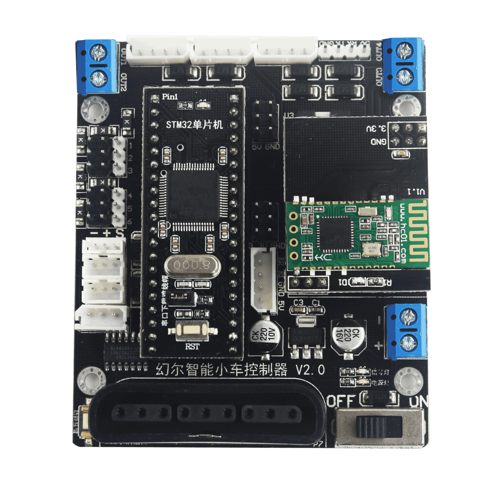
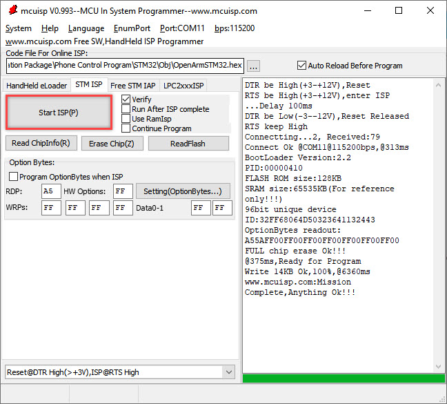
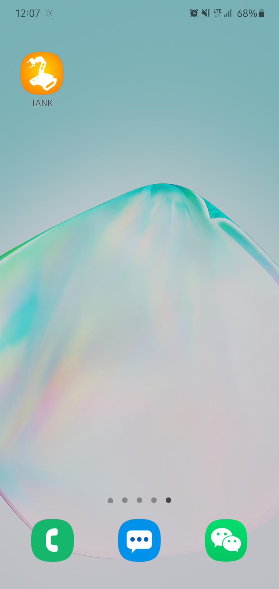
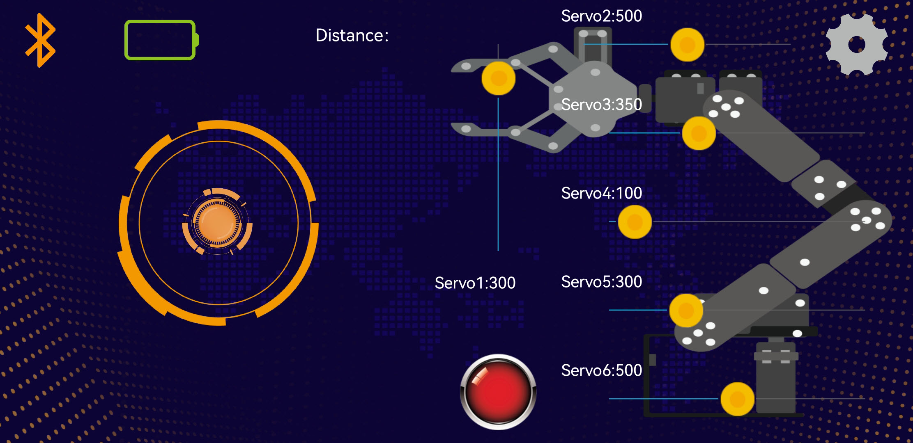
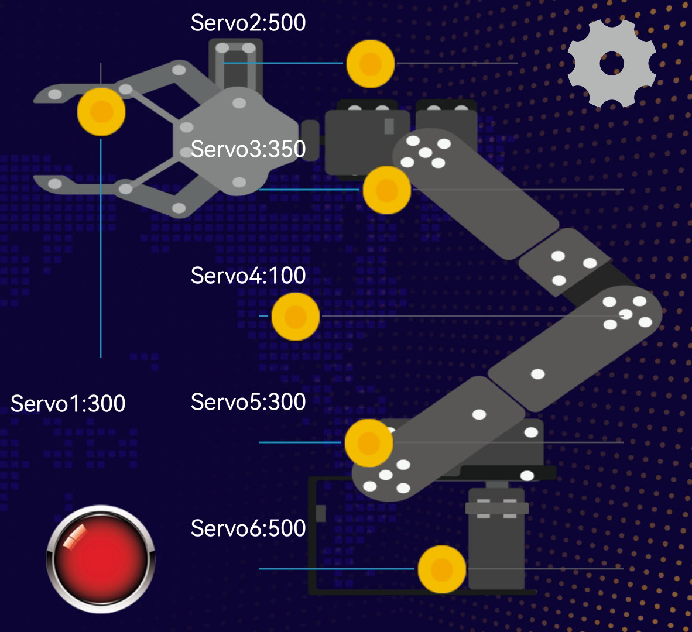

# 5.Remote Control
## 5.1 Lesson 1 Handle Control

The demo video in this folder is for reference.

### 5.1.1 Preparation

1)  Install the handle receiver on the controller.

2)  Prepare two AAA batteries, and insert them into the battery slot. Please don’t invert the positive and negative pole. 

### 5.1.2 Program logic

The Human-Computer interface bear great importance in the control system. Handle control is direct and convenient. And here we use PS handle to control the robot. PS handle is ideal for controlling robot for the reason that only 4 signal lines are needed in the communication between PS handle and microcontroller, less I/O interface will be occupied and communication protocol is simple.

### 5.1.3 Operation steps

1)  Remove the jumper cap on STM32.

2)  Connect the controller to the computer through USB downloader.

3)  Double click to open mcuisp downloader

4)  Select the corresponding port and baud rate. Then, open the compiled hex file and click “Start Programming”.

5)  Wail for the program to burn. After the program is burned, reinsert the jumper cap into STM32, and press RST button.

### 5.1.4 Function realization

#### 5.1.4.1 Device connection

Step 1: switch on the Tankbot

Step 2: turn on the handle, then red and green LED light will flash simultaneously.

Step 3: after a few seconds, Tankbot will match the handle automatically. After successful match, the red and green LED will be on.

Step 4: if the connection doesn’t work, please turn off the Tankbot and handle. Then repeat the previous step.

Sleep mode: if the handle doesn’t connect to Tankbot within 30s after turning on, or there is no operation on the handle within 5 minutes after connection. It will enter sleep mode

#### 5.1.4.2 Key function

| **Key** | **Function** |
|:--:|:--:|
| START | reset/ restart the robotic arm |
| Left joystick | Rotate to make the tank turn forward, backward, left and right |
| ↑ | Lower down the robotic arm |
| ↓ | Lift the robotic arm |
| ← | make the robotic arm turn left |
| → | make the robotic arm turn right |
| **△** | lower down the upper part of the robotic arm |
| **×** | Lift the upper part of the robotic arm |
| **◻** | lower down the gripper |
| ○ | lift the gripper |
| **L1** | make the gripper turn left |
| **R1** | make the gripper turn right |
| **L2** | Close the gripper |

## 5.2 Lesson 2 Phone Control

The demo video is in this folder for your reference.

### 5.2.1 Preparation

1)  Insert the Bluetooth module into the controller as the picture shown.

2)  Find “Tankbot-V1.5.apk” in the folder “Phone Control Program and APP Installation Package-\>APP Installation Package”.

### 5.2.2 Program logic

In this lesson, we will control the Tankbot through the mobile APP. Phone control is realized by the inserted Bluetooth module on the controller. Bluetooth communication work in this way one send, the other receive and one receive and the other send. For more introduction to Bluetooth module, you can refer to the corresponding file in “6.Expanded Lesson-\>4.Related Bluetooth Material”.

### 5.2.3 Operation step

1)  Remove the jumper cap on STM32.

2)  Connect the controller to the computer through USB downloader.

3)  Double click to open mcuisp downloader

4)  Select the corresponding port and baud rate. Then, open the compiled hex file and click “Start Programming”.

5)  Wail for the program to burn. After the program is burned, reinsert the jumper cap into STM32, and press RST button.

### 5.2.4 Function realization

#### 5.2.4.1 Device connection

Notes:

1)  Before using the APP, please turn on the Bluetooth and Location.

2)  Please directly pair the device by clicking the Bluetooth icon in the APP interface. Don’t operate in the phone settings through code.

<!-- -->

1)  Open the APP

2)  Click the flashing Bluetooth icon in the APP main interface to search the around device. Wait for a while, and select “Hiwonder”.

3)  After successful connection, the Bluetooth icon will be on and the battery level of the robot will be displayed at the upper left corner.

#### 5.2.4.3 Key function

|                                                              |                                                              |
| :----------------------------------------------------------: | :----------------------------------------------------------: |
|                             Icon                             |                           Function                           |
|  | Drag the icon to control Tankbot move forward, backward and rotate. |
|  | Drag to control the movement of NO. 1-6 servo on the robotic arm. |
|  | By tapping this icon, the robotic arm will stop the current action and stand at attention. And all the servos will return to the midline. |
|  | Tap this icon to set the tank speed and check the APP version. |
|  | Tap the Bluetooth icon to search the device. After successful connection, the Bluetooth icon will light up. Tap it again to disconnect the device. |
|  |            Display the battery level of the robot            |
|  |            Distance measured by ultrasonic sensor            |
